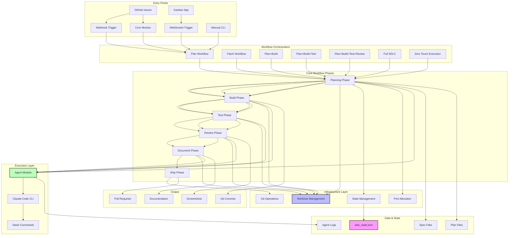
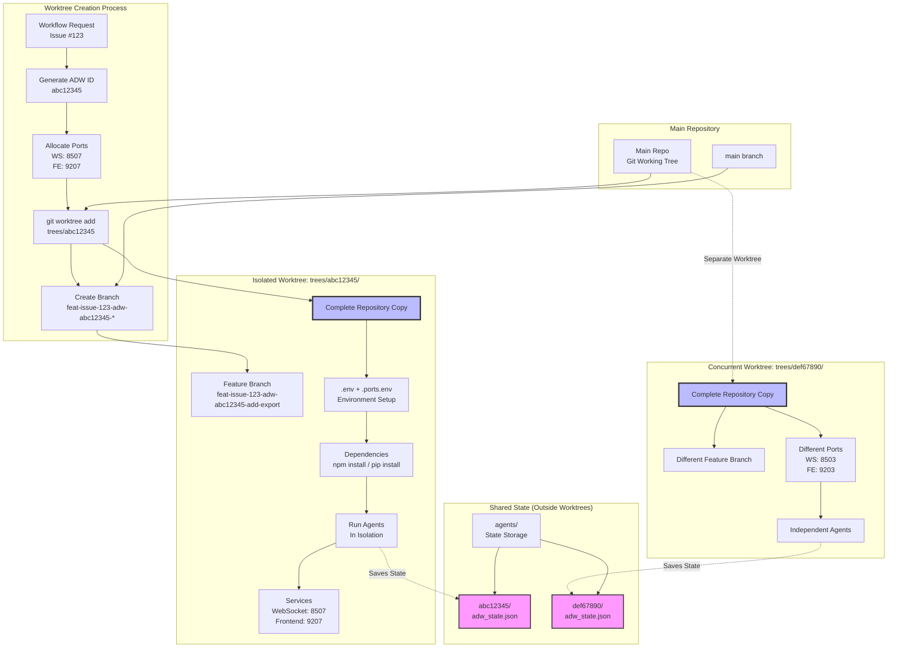
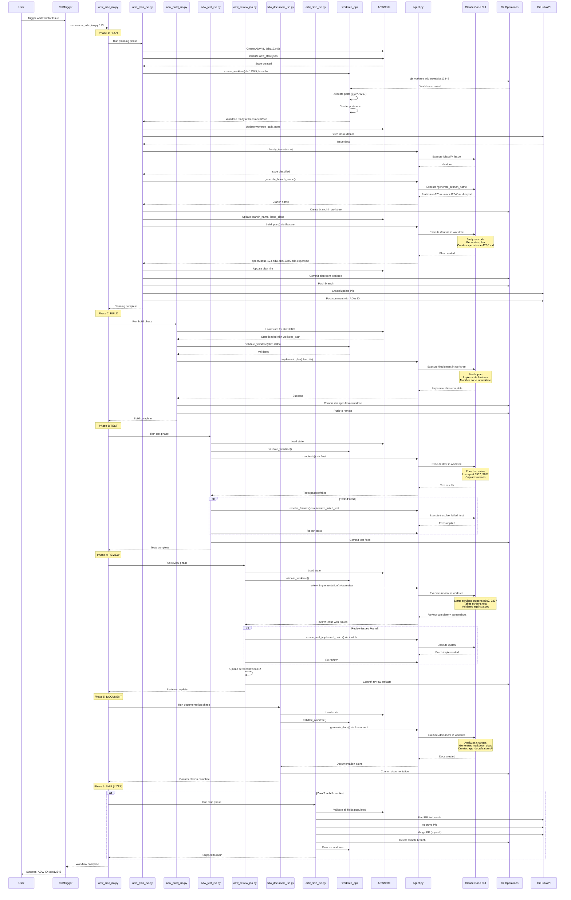
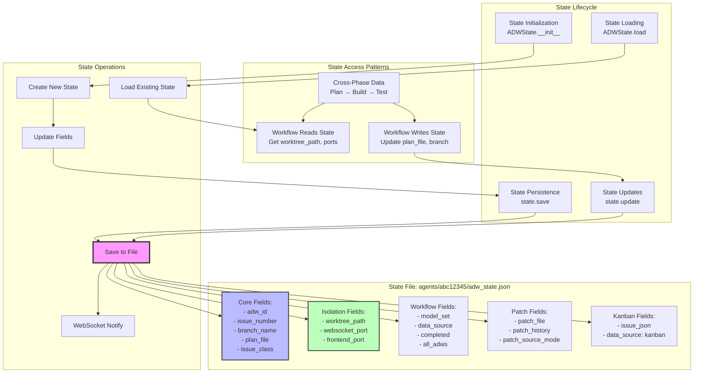
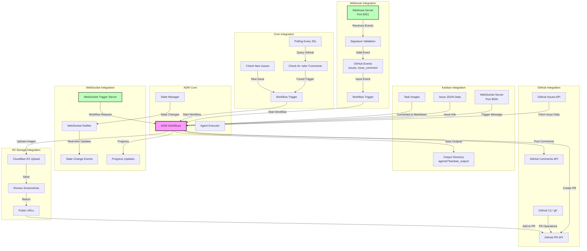

# ADW System Deep Dive - Complete Under-the-Hood Guide

This document provides a comprehensive visual guide to the **Agentic Development Workflow (ADW)** system, explaining every detail of how it works under the hood.

## Table of Contents

1. [System Architecture Overview](#system-architecture-overview)
2. [File & Directory Structure](#file--directory-structure)
3. [Worktree Isolation Model](#worktree-isolation-model)
4. [Complete Workflow Execution Flow](#complete-workflow-execution-flow)
5. [State Management Deep Dive](#state-management-deep-dive)
6. [Agent Execution Mechanics](#agent-execution-mechanics)
7. [Port Allocation System](#port-allocation-system)
8. [Integration Points](#integration-points)
9. [File Creation Timeline](#file-creation-timeline)
10. [Data Flow Through The System](#data-flow-through-the-system)

---

## System Architecture Overview

The ADW system is a multi-layered architecture that enables isolated, concurrent software development workflows.



**Key Layers:**

1. **Entry Points**: Multiple ways to trigger workflows (GitHub, Webhook, Cron, WebSocket, CLI)
2. **Orchestrators**: Composite workflows that chain multiple phases
3. **Core Phases**: Individual workflow steps (Plan, Build, Test, Review, Document, Ship)
4. **Infrastructure**: Worktree isolation, state persistence, port management
5. **Execution**: Agent-based execution via Claude Code CLI
6. **Output**: Generated artifacts (PRs, commits, docs, screenshots)

---

## File & Directory Structure

Understanding where and how files are created is crucial to understanding the system.

```mermaid
graph TD
    subgraph "Project Root"
        ADWS[adws/]
        TREES[trees/]
        AGENTS[agents/]
        SPECS_DIR[specs/]
        APP_DOCS[app_docs/]
    end

    subgraph "adws/ - ADW Scripts & Modules"
        ADW_SCRIPTS[Workflow Scripts<br/>adw_plan_iso.py<br/>adw_build_iso.py<br/>etc.]
        MODULES[adw_modules/<br/>agent.py<br/>workflow_ops.py<br/>state.py<br/>worktree_ops.py<br/>git_ops.py]
        TRIGGERS[adw_triggers/<br/>trigger_webhook.py<br/>trigger_cron.py<br/>trigger_websocket.py]
    end

    subgraph "trees/ - Isolated Worktrees"
        WT1[abc12345/<br/>Complete Repo Copy]
        WT2[def67890/<br/>Complete Repo Copy]
        WTN[...more worktrees]
    end

    subgraph "trees/abc12345/ - Worktree Structure"
        WT_APP[app/<br/>Application Code]
        WT_ENV[.env<br/>Copied from main]
        WT_PORTS[.ports.env<br/>Port Config]
        WT_SPECS[specs/<br/>Spec Files]
        WT_GIT[.git<br/>Worktree Git Dir]
    end

    subgraph "agents/ - Workflow State & Artifacts"
        ADW1[abc12345/]
        ADW2[def67890/]
    end

    subgraph "agents/abc12345/ - ADW Instance"
        STATE_FILE[adw_state.json<br/>Persistent State]
        PLANNER_DIR[sdlc_planner/<br/>raw_output.jsonl<br/>prompts/]
        IMPLEMENTOR_DIR[sdlc_implementor/<br/>raw_output.jsonl]
        TESTER_DIR[tester/<br/>raw_output.jsonl]
        REVIEWER_DIR[reviewer/<br/>raw_output.jsonl<br/>review_img/]
        DOCUMENTER_DIR[documenter/<br/>raw_output.jsonl]
        PLAN_FILE[abc12345_plan_spec.md]
        PATCH_DIR[patch_*/]
    end

    subgraph "specs/ - Implementation Specs"
        SPEC_FILES[issue-123-adw-abc12345-*.md<br/>Generated by planner]
    end

    subgraph "app_docs/ - Generated Documentation"
        FEATURE_DOCS[features/<br/>feature-name/<br/>overview.md<br/>technical-guide.md<br/>images/]
    end

    ADWS --> ADW_SCRIPTS
    ADWS --> MODULES
    ADWS --> TRIGGERS

    TREES --> WT1
    TREES --> WT2
    TREES --> WTN

    WT1 --> WT_APP
    WT1 --> WT_ENV
    WT1 --> WT_PORTS
    WT1 --> WT_SPECS
    WT1 --> WT_GIT

    AGENTS --> ADW1
    AGENTS --> ADW2

    ADW1 --> STATE_FILE
    ADW1 --> PLANNER_DIR
    ADW1 --> IMPLEMENTOR_DIR
    ADW1 --> TESTER_DIR
    ADW1 --> REVIEWER_DIR
    ADW1 --> DOCUMENTER_DIR
    ADW1 --> PLAN_FILE
    ADW1 --> PATCH_DIR

    SPECS_DIR --> SPEC_FILES
    APP_DOCS --> FEATURE_DOCS

    style STATE_FILE fill:#f9f,stroke:#333,stroke-width:3px
    style WT1 fill:#bbf,stroke:#333,stroke-width:3px
    style MODULES fill:#bfb,stroke:#333,stroke-width:2px
```



**Key Directories:**

- **adws/**: ADW system code (never modified during workflow execution)
- **trees/**: Isolated git worktrees (one per ADW instance)
- **agents/**: Workflow state and execution artifacts (shared, not in worktree)
- **specs/**: Implementation specifications
- **app_docs/**: Generated documentation

---

## Worktree Isolation Model

Each ADW workflow runs in complete isolation using git worktrees.



**Isolation Benefits:**

1. **Parallel Execution**: Up to 15 concurrent ADW instances
2. **No Interference**: Each instance has its own filesystem, branch, and ports
3. **Clean State**: Changes in one worktree don't affect others
4. **Easy Cleanup**: Remove worktree directory to clean everything
5. **Debugging**: Isolated environment makes troubleshooting easier

---

## Complete Workflow Execution Flow

This shows the detailed step-by-step execution of a full SDLC workflow.



**Key Execution Points:**

1. **State Initialization**: ADW ID and state file created first
2. **Worktree Creation**: Isolated environment set up before any work
3. **Port Allocation**: Deterministic port assignment based on ADW ID
4. **Agent Execution**: All work done via Claude Code in worktree context
5. **State Persistence**: State saved after each phase for resumability
6. **Git Operations**: All commits/pushes happen from within worktree

---

## State Management Deep Dive

State is the backbone that connects all workflow phases together.



**State Flow Example:**

```python
# Phase 1: Planning (adw_plan_iso.py)
state = ADWState(adw_id="abc12345")
state.update(
    issue_number="123",
    worktree_path="/path/to/trees/abc12345",
    websocket_port=8507,
    frontend_port=9207
)
state.save("plan_phase")  # Saves to agents/abc12345/adw_state.json

# Phase 2: Building (adw_build_iso.py)
state = ADWState.load("abc12345")  # Loads from file
worktree_path = state.get("worktree_path")  # Gets "/path/to/trees/abc12345"
state.update(branch_name="feat-issue-123-...")
state.save("build_phase")

# Phase 3: Testing (adw_test_iso.py)
state = ADWState.load("abc12345")
ports = (state.get("websocket_port"), state.get("frontend_port"))
# Use ports 8507, 9207 for testing
```

**State Validation:**

The state uses Pydantic models (`ADWStateData`) for:
- Type validation
- Required field checking
- Default value assignment
- JSON serialization/deserialization

---

## Agent Execution Mechanics

How agents actually execute Claude Code commands.

```mermaid
sequenceDiagram
    participant Workflow as Workflow Script
    participant WorkflowOps as workflow_ops.py
    participant Agent as agent.py
    participant State as ADWState
    participant FS as File System
    participant CC as Claude Code CLI
    participant Slash as Slash Command

    Workflow->>WorkflowOps: implement_plan(plan_file, adw_id)
    WorkflowOps->>Agent: execute_template(request)

    Note over Agent: Build execution request
    Agent->>State: Load state for model_set
    State-->>Agent: model_set = "base"

    Agent->>Agent: get_model_for_slash_command()<br/>Returns "sonnet" for base

    Agent->>Agent: Build command:<br/>claude --headless \<br/>--model sonnet \<br/>--output agents/abc12345/implementor/raw_output.jsonl \<br/>--cwd trees/abc12345 \<br/>/implement plan_file

    Agent->>FS: Create output directory<br/>agents/abc12345/implementor/

    Agent->>CC: subprocess.run(command)

    Note over CC: Claude Code starts in headless mode
    CC->>Slash: Load /implement command<br/>from .claude/commands/implement.md

    Note over Slash: Command expands with variables:<br/>- plan_file path<br/>- working directory<br/>- agent context

    Slash->>CC: Expanded prompt:<br/>"Implement the plan at {plan_file}....."

    Note over CC: Claude executes in worktree context:<br/>- Reads files from trees/abc12345/<br/>- Writes files to trees/abc12345/<br/>- Uses git in worktree<br/>- Logs to raw_output.jsonl

    CC->>FS: Write JSONL logs:<br/>agents/abc12345/implementor/raw_output.jsonl

    loop Each Claude Turn
        CC->>FS: Read code files
        CC->>FS: Modify code files
        CC->>FS: Append JSONL log entry
    end

    Note over CC: Final result message:<br/>{"type": "result", "result": "...", "total_cost_usd": 0.42}

    CC-->>Agent: Exit code 0 (success)

    Agent->>FS: Read raw_output.jsonl
    Agent->>Agent: Parse JSONL messages
    Agent->>Agent: Extract final result

    Agent-->>WorkflowOps: AgentPromptResponse(output="Success", success=True)
    WorkflowOps-->>Workflow: Implementation complete

    style CC fill:#bfb,stroke:#333,stroke-width:3px
    style FS fill:#bbf,stroke:#333,stroke-width:2px
```

**Command Construction:**

```python
# In agent.py: execute_template()
def execute_template(request: AgentTemplateRequest) -> AgentPromptResponse:
    # 1. Get the appropriate model
    model = get_model_for_slash_command(request)  # "sonnet" or "haiku"

    # 2. Build output path
    output_file = f"agents/{request.adw_id}/{request.agent_name}/raw_output.jsonl"

    # 3. Construct command
    command = [
        "claude",                    # Claude Code CLI
        "--headless",                # No interactive mode
        "--model", model,            # Model selection
        "--output", output_file,     # JSONL output
        "--cwd", working_dir,        # Worktree path
        request.slash_command,       # e.g., "/implement"
        *request.args                # Command arguments
    ]

    # 4. Execute with subprocess
    result = subprocess.run(command, env=safe_env, capture_output=True)

    # 5. Parse output
    messages, result_msg = parse_jsonl_output(output_file)

    return AgentPromptResponse(...)
```

---

## Port Allocation System

Deterministic port allocation enables concurrent worktrees.

```mermaid
graph TB
    subgraph "Port Allocation Process"
        ADW_ID[ADW ID: abc12345]
        HASH[Hash First 8 Chars<br/>Base36 Conversion]
        INDEX[Index = hash % 15<br/>Result: 7]
        WS_PORT[WebSocket Port<br/>8500 + 7 = 8507]
        FE_PORT[Frontend Port<br/>9200 + 7 = 9207]
    end

    subgraph "Port Ranges (15 Slots)"
        WS_RANGE[WebSocket Range<br/>8500 - 8514]
        FE_RANGE[Frontend Range<br/>9200 - 9214]
    end

    subgraph "Port Assignment Table"
        TABLE["Index | ADW ID Example | WebSocket | Frontend<br/>
        0     | 0a68b3d4        | 8500      | 9200<br/>
        1     | ...             | 8501      | 9201<br/>
        2     | ...             | 8502      | 9202<br/>
        3     | def67890        | 8503      | 9203<br/>
        ...<br/>
        7     | abc12345        | 8507      | 9207<br/>
        ...<br/>
        14    | ...             | 8514      | 9214"]
    end

    subgraph "Conflict Resolution"
        CHECK[Check Port Available<br/>socket.bind()]
        AVAILABLE{Port<br/>Available?}
        USE[Use Port]
        NEXT[Try Next Index<br/>(index + 1) % 15]
        FAIL[All Ports Busy<br/>Raise Error]
    end

    subgraph ".ports.env File"
        ENV_FILE["WEBSOCKET_PORT=8507<br/>
        FRONTEND_PORT=9207<br/>
        VITE_BACKEND_URL=http://localhost:8507"]
    end

    ADW_ID --> HASH
    HASH --> INDEX
    INDEX --> WS_PORT
    INDEX --> FE_PORT

    WS_PORT --> WS_RANGE
    FE_PORT --> FE_RANGE

    INDEX --> TABLE

    WS_PORT --> CHECK
    FE_PORT --> CHECK
    CHECK --> AVAILABLE
    AVAILABLE -->|Yes| USE
    AVAILABLE -->|No| NEXT
    NEXT --> CHECK
    NEXT -.->|After 15 tries| FAIL

    USE --> ENV_FILE

    style INDEX fill:#f9f,stroke:#333,stroke-width:2px
    style ENV_FILE fill:#bfb,stroke:#333,stroke-width:2px
    style TABLE fill:#bbf,stroke:#333,stroke-width:2px
```

**Port Allocation Code:**

```python
# In worktree_ops.py
def get_ports_for_adw(adw_id: str) -> Tuple[int, int]:
    """Deterministically assign ports based on ADW ID."""
    # Convert first 8 chars to base 36, mod 15 for index
    id_chars = ''.join(c for c in adw_id[:8] if c.isalnum())
    index = int(id_chars, 36) % 15

    websocket_port = 8500 + index  # Range: 8500-8514
    frontend_port = 9200 + index   # Range: 9200-9214

    return websocket_port, frontend_port

def find_next_available_ports(adw_id: str) -> Tuple[int, int]:
    """Find available ports with fallback."""
    base_ws, base_fe = get_ports_for_adw(adw_id)
    base_index = base_ws - 8500

    for offset in range(15):  # Try all 15 slots
        index = (base_index + offset) % 15
        ws_port = 8500 + index
        fe_port = 9200 + index

        if is_port_available(ws_port) and is_port_available(fe_port):
            return ws_port, fe_port

    raise RuntimeError("No available ports")
```

---

## Integration Points

How ADW integrates with external systems.



**Integration Modes:**

1. **GitHub Mode** (Default):
   - Fetches issues via GitHub API
   - Posts comments via GitHub API
   - Creates PRs via `gh` CLI
   - Full git operations (commit, push, merge)

2. **Kanban Mode**:
   - Receives issues via WebSocket
   - No GitHub comments (kanban-only output)
   - Optional git operations
   - Saves outputs to `agents/*/kanban_output/`

3. **Hybrid Mode**:
   - Triggered via Kanban
   - Executes full GitHub workflow
   - Updates both systems

---

## File Creation Timeline

When and where files are created during a workflow.

```mermaid
gantt
    title File & Directory Creation Timeline (SDLC Workflow)
    dateFormat X
    axisFormat %s

    section State & Config
    Create agents/<adw_id>/ directory          :0, 1
    Create adw_state.json (initial)            :1, 2

    section Worktree Setup
    Create trees/<adw_id>/ directory           :2, 3
    git worktree add trees/<adw_id>            :3, 5
    Copy .env to worktree                      :5, 6
    Create .ports.env in worktree              :6, 7

    section Planning Phase
    Create agents/<adw_id>/sdlc_planner/       :7, 8
    Create sdlc_planner/prompts/               :8, 9
    Save /classify_issue prompt                :9, 10
    Execute /classify_issue                    :10, 12
    Create sdlc_planner/raw_output.jsonl       :12, 14
    Save /feature (or /bug, /chore) prompt     :14, 15
    Execute /feature                           :15, 20
    Create specs/issue-123-adw-abc12345-*.md   :20, 22
    Create <adw_id>_plan_spec.md               :22, 23
    Update adw_state.json (plan_file, branch)  :23, 24

    section Build Phase
    Create agents/<adw_id>/sdlc_implementor/   :24, 25
    Save /implement prompt                     :25, 26
    Execute /implement                         :26, 35
    Create implementor/raw_output.jsonl        :26, 35
    Modify source code files in worktree       :30, 35
    Update adw_state.json (after build)        :35, 36

    section Test Phase
    Create agents/<adw_id>/tester/             :36, 37
    Save /test prompt                          :37, 38
    Execute /test                              :38, 45
    Create tester/raw_output.jsonl             :38, 45
    Create test result logs                    :42, 43
    If tests fail: /resolve_failed_test        :45, 50
    Update adw_state.json (after test)         :50, 51

    section Review Phase
    Create agents/<adw_id>/reviewer/           :51, 52
    Create reviewer/review_img/                :52, 53
    Save /review prompt                        :53, 54
    Execute /review                            :54, 65
    Create reviewer/raw_output.jsonl           :54, 65
    Take screenshots → review_img/*.png        :60, 62
    Upload screenshots to R2                   :62, 63
    If issues: Create patch_1/                 :65, 66
    If issues: Execute /patch                  :66, 72
    Update adw_state.json (after review)       :72, 73

    section Document Phase
    Create agents/<adw_id>/documenter/         :73, 74
    Save /document prompt                      :74, 75
    Execute /document                          :75, 85
    Create documenter/raw_output.jsonl         :75, 85
    Create app_docs/features/<name>/           :80, 81
    Create overview.md, technical-guide.md     :81, 84
    Create app_docs/features/<name>/images/    :84, 85
    Update adw_state.json (after document)     :85, 86

    section Shipping Phase
    Execute /ship (if ZTE mode)                :86, 90
    Merge PR to main                           :90, 91
    Delete remote branch                       :91, 92
    Remove worktree trees/<adw_id>/            :92, 93
    Mark adw_state.json as completed           :93, 94
```

**File Creation Summary:**

| Phase | Files Created | Location |
|-------|---------------|----------|
| **Initialization** | `adw_state.json` | `agents/<adw_id>/` |
| **Worktree** | Complete repo copy, `.ports.env` | `trees/<adw_id>/` |
| **Planning** | `raw_output.jsonl`, prompts, spec file | `agents/<adw_id>/sdlc_planner/`, `specs/` |
| **Building** | `raw_output.jsonl`, modified source | `agents/<adw_id>/sdlc_implementor/`, worktree |
| **Testing** | `raw_output.jsonl`, test logs | `agents/<adw_id>/tester/` |
| **Review** | `raw_output.jsonl`, screenshots | `agents/<adw_id>/reviewer/`, `reviewer/review_img/` |
| **Document** | `raw_output.jsonl`, markdown docs | `agents/<adw_id>/documenter/`, `app_docs/features/` |
| **Patch** | `patch_<n>/`, patch specs | `agents/<adw_id>/patch_<n>/` |

---

## Data Flow Through The System

How data flows from trigger to completion.

```mermaid
flowchart TD
    START([User Triggers Workflow<br/>Issue #123])

    subgraph "1. Input Processing"
        INPUT[Parse Input<br/>issue_number, adw_id?]
        ENSURE_ID[ensure_adw_id<br/>Create or load ADW ID]
        INIT_STATE[Initialize ADWState<br/>Create agents/<adw_id>/]
    end

    subgraph "2. Worktree Setup"
        CREATE_WT[create_worktree<br/>trees/<adw_id>/]
        ALLOC_PORTS[Allocate Ports<br/>8500-8514, 9200-9214]
        SETUP_ENV[Create .ports.env<br/>Copy .env]
        SAVE_WT_STATE[Save State<br/>worktree_path, ports]
    end

    subgraph "3. Issue Classification"
        FETCH_ISSUE[Fetch GitHub Issue<br/>Title, Body, Labels]
        CLASSIFY[classify_issue via Claude<br/>/classify_issue]
        ISSUE_CLASS{Issue<br/>Type?}
        CLASS_BUG[/bug]
        CLASS_FEATURE[/feature]
        CLASS_CHORE[/chore]
        SAVE_CLASS[Save issue_class to State]
    end

    subgraph "4. Branch Creation"
        GEN_BRANCH[generate_branch_name via Claude<br/>/generate_branch_name]
        CREATE_BRANCH[Create Branch in Worktree<br/>git checkout -b]
        SAVE_BRANCH[Save branch_name to State]
    end

    subgraph "5. Planning"
        BUILD_PLAN[build_plan via Claude<br/>Execute /<issue_class>]
        CREATE_SPEC[Create Spec File<br/>specs/issue-123-*.md]
        SAVE_PLAN[Save plan_file to State]
        COMMIT_PLAN[Commit from Worktree<br/>git commit + push]
        CREATE_PR[Create/Update PR<br/>gh pr create]
    end

    subgraph "6. Implementation"
        LOAD_PLAN[Load plan_file from State]
        IMPLEMENT[implement_plan via Claude<br/>/implement]
        MODIFY_CODE[Modify Source Code<br/>in Worktree]
        COMMIT_IMPL[Commit Implementation<br/>git commit + push]
    end

    subgraph "7. Testing"
        RUN_TESTS[run_tests via Claude<br/>/test]
        TEST_RESULT{Tests<br/>Pass?}
        RESOLVE_TESTS[resolve_failures via Claude<br/>/resolve_failed_test]
        COMMIT_TESTS[Commit Test Fixes]
    end

    subgraph "8. Review"
        REVIEW[review_implementation via Claude<br/>/review]
        SCREENSHOTS[Take Screenshots<br/>Save to review_img/]
        REVIEW_RESULT{Issues<br/>Found?}
        CREATE_PATCH[create_and_implement_patch<br/>/patch]
        UPLOAD_IMG[Upload to R2<br/>Get public URLs]
        COMMIT_REVIEW[Commit Review Artifacts]
    end

    subgraph "9. Documentation"
        GEN_DOCS[generate_docs via Claude<br/>/document]
        CREATE_DOCS[Create Markdown Files<br/>app_docs/features/]
        COMMIT_DOCS[Commit Documentation]
    end

    subgraph "10. Shipping (Optional)"
        VALIDATE_STATE[Validate State Complete<br/>All required fields]
        FIND_PR[Find PR for Branch<br/>gh pr list]
        APPROVE[Approve PR<br/>gh pr review]
        MERGE[Merge PR<br/>gh pr merge --squash]
        CLEANUP[Remove Worktree<br/>Delete Branch]
        MARK_COMPLETE[Mark State completed=true]
    end

    END([Workflow Complete<br/>ADW ID: abc12345])

    START --> INPUT
    INPUT --> ENSURE_ID
    ENSURE_ID --> INIT_STATE

    INIT_STATE --> CREATE_WT
    CREATE_WT --> ALLOC_PORTS
    ALLOC_PORTS --> SETUP_ENV
    SETUP_ENV --> SAVE_WT_STATE

    SAVE_WT_STATE --> FETCH_ISSUE
    FETCH_ISSUE --> CLASSIFY
    CLASSIFY --> ISSUE_CLASS
    ISSUE_CLASS --> CLASS_BUG
    ISSUE_CLASS --> CLASS_FEATURE
    ISSUE_CLASS --> CLASS_CHORE
    CLASS_BUG --> SAVE_CLASS
    CLASS_FEATURE --> SAVE_CLASS
    CLASS_CHORE --> SAVE_CLASS

    SAVE_CLASS --> GEN_BRANCH
    GEN_BRANCH --> CREATE_BRANCH
    CREATE_BRANCH --> SAVE_BRANCH

    SAVE_BRANCH --> BUILD_PLAN
    BUILD_PLAN --> CREATE_SPEC
    CREATE_SPEC --> SAVE_PLAN
    SAVE_PLAN --> COMMIT_PLAN
    COMMIT_PLAN --> CREATE_PR

    CREATE_PR --> LOAD_PLAN
    LOAD_PLAN --> IMPLEMENT
    IMPLEMENT --> MODIFY_CODE
    MODIFY_CODE --> COMMIT_IMPL

    COMMIT_IMPL --> RUN_TESTS
    RUN_TESTS --> TEST_RESULT
    TEST_RESULT -->|Fail| RESOLVE_TESTS
    RESOLVE_TESTS --> RUN_TESTS
    TEST_RESULT -->|Pass| COMMIT_TESTS

    COMMIT_TESTS --> REVIEW
    REVIEW --> SCREENSHOTS
    SCREENSHOTS --> REVIEW_RESULT
    REVIEW_RESULT -->|Issues| CREATE_PATCH
    CREATE_PATCH --> REVIEW
    REVIEW_RESULT -->|No Issues| UPLOAD_IMG
    UPLOAD_IMG --> COMMIT_REVIEW

    COMMIT_REVIEW --> GEN_DOCS
    GEN_DOCS --> CREATE_DOCS
    CREATE_DOCS --> COMMIT_DOCS

    COMMIT_DOCS --> VALIDATE_STATE
    VALIDATE_STATE --> FIND_PR
    FIND_PR --> APPROVE
    APPROVE --> MERGE
    MERGE --> CLEANUP
    CLEANUP --> MARK_COMPLETE

    MARK_COMPLETE --> END

    style START fill:#bfb,stroke:#333,stroke-width:3px
    style END fill:#bfb,stroke:#333,stroke-width:3px
    style INIT_STATE fill:#f9f,stroke:#333,stroke-width:2px
    style SAVE_WT_STATE fill:#f9f,stroke:#333,stroke-width:2px
    style CREATE_WT fill:#bbf,stroke:#333,stroke-width:2px
```

**Data Transformations:**

1. **Issue #123** → Fetch from GitHub → **GitHubIssue object**
2. **GitHubIssue** → Claude `/classify_issue` → **/feature**
3. **GitHubIssue + /feature** → Claude `/feature` → **Plan spec file**
4. **Plan spec** → Claude `/implement` → **Modified source code**
5. **Source code** → Claude `/test` → **Test results**
6. **Implementation** → Claude `/review` → **Screenshots + review issues**
7. **Review issues** → Claude `/patch` → **Patch fixes**
8. **All changes** → Claude `/document` → **Documentation**
9. **Branch** → GitHub PR → **Merged to main**

---

## Summary

The ADW system is a sophisticated, multi-layered architecture that:

1. **Isolates Workflows**: Each ADW instance runs in its own git worktree with dedicated ports
2. **Persists State**: All workflow data saved to `adw_state.json` for resumability
3. **Executes via Agents**: Claude Code CLI executes slash commands in isolated context
4. **Manages Files**: Systematic file creation across multiple directories
5. **Integrates Multiple Systems**: GitHub, Kanban, WebSocket, Webhook, Cron
6. **Enables Concurrency**: Up to 15 parallel workflows via deterministic port allocation
7. **Provides Flexibility**: Modular phases can be run individually or composed

**Key Files Created:**

- `agents/<adw_id>/adw_state.json` - Persistent state
- `trees/<adw_id>/` - Isolated worktree with complete repo
- `agents/<adw_id>/<agent_name>/raw_output.jsonl` - Agent execution logs
- `specs/issue-*-adw-*-*.md` - Implementation specifications
- `agents/<adw_id>/reviewer/review_img/*.png` - Review screenshots
- `app_docs/features/*/` - Generated documentation

**Execution Context:**

Every Claude Code execution runs with:
- `--cwd trees/<adw_id>` - Isolated worktree
- `--output agents/<adw_id>/<agent>/raw_output.jsonl` - Logged output
- `--model sonnet|haiku` - Model selection based on state
- Slash command with arguments

This architecture enables robust, concurrent, resumable AI-driven development workflows with full isolation and traceability.
