# ADW System Complete Documentation Index

Welcome to the comprehensive documentation for the **Agentic Development Workflow (ADW)** system. This index will guide you to the right documentation based on your needs.

## Quick Navigation

### I Want To...

| Goal | Documentation | Quick Link |
|------|---------------|------------|
| **Understand the overall system** | [Deep Dive Guide](#deep-dive-guide) | Architecture, workflows, file creation |
| **See concrete examples** | [Quick Reference](#quick-reference-guide) | Real walkthroughs, scenarios |
| **Look up technical details** | [Technical Specs](#technical-specifications) | Data models, APIs, protocols |
| **Learn from README** | [Main README](#main-readme) | Getting started, usage |
| **Get started quickly** | [Quick Start](#quick-start) | 5-minute setup |

---

## Documentation Suite

### Deep Dive Guide

**File:** `adw_system_deep_dive.md`

**Best For:** Understanding how everything works under the hood

**Contents:**

1. **System Architecture Overview**
   - Multi-layered architecture diagram
   - Component relationships
   - Data flow

2. **File & Directory Structure**
   - Where every file lives
   - Directory organization
   - File creation patterns

3. **Worktree Isolation Model**
   - How isolation works
   - Concurrent execution
   - Port allocation

4. **Complete Workflow Execution Flow**
   - Sequence diagrams
   - Phase-by-phase breakdown
   - State transitions

5. **State Management Deep Dive**
   - State lifecycle
   - Persistence mechanisms
   - Cross-phase data sharing

6. **Agent Execution Mechanics**
   - How Claude Code is invoked
   - Command construction
   - JSONL output parsing

7. **Port Allocation System**
   - Deterministic assignment
   - Conflict resolution
   - Available ranges

8. **Integration Points**
   - GitHub, Kanban, WebSocket
   - Multiple trigger modes
   - Hybrid workflows

9. **File Creation Timeline**
   - When each file is created
   - Gantt chart visualization
   - Directory structure evolution

10. **Data Flow Through System**
    - Input to output transformation
    - Data model transitions
    - Artifact generation

**Visual Aids:** 10+ Mermaid diagrams showing architecture, workflows, and data flow

---

### Quick Reference Guide

**File:** `adw_system_quick_reference.md`

**Best For:** Concrete examples and troubleshooting

**Contents:**

1. **Workflow Types Comparison**
   - Visual comparison chart
   - Selection guide
   - Time estimates

2. **Real Example Walkthrough**
   - Issue #456: Add CSV export button
   - Complete lifecycle from trigger to merge
   - All files created with actual content

3. **File Locations Cheat Sheet**
   - Quick lookup table
   - Directory tree visualization
   - Common file patterns

4. **Common Scenarios**
   - Resume failed workflow
   - Run multiple ADWs in parallel
   - Debug Claude execution
   - Manually merge after review
   - Check port usage
   - Rerun specific phases

5. **Debugging Guide**
   - Common errors and solutions
   - Diagnostic commands
   - Recovery procedures

**Visual Aids:** Workflow diagrams, directory trees, comparison charts

**Example Code:** Real file contents, command outputs, JSON data

---

### Technical Specifications

**File:** `adw_system_technical_specs.md`

**Best For:** API reference and data models

**Contents:**

1. **Data Models**
   - `ADWStateData` - Core state model
   - `GitHubIssue` - Issue representation
   - `AgentPromptRequest` - Claude execution config
   - `AgentTemplateRequest` - Slash command config
   - `ReviewResult` - Review phase output
   - All Pydantic models with examples

2. **State Management API**
   - Creating state: `ADWState(adw_id)`
   - Loading state: `ADWState.load(adw_id)`
   - Updating: `state.update(**kwargs)`
   - Saving: `state.save(workflow_step)`
   - All methods documented

3. **Agent Execution API**
   - `execute_template()` - Run slash commands
   - `prompt_claude_code()` - Custom prompts
   - `get_model_for_slash_command()` - Model selection
   - Retry logic

4. **Worktree Operations API**
   - `create_worktree()` - Initialize isolation
   - `validate_worktree()` - Three-way validation
   - `get_ports_for_adw()` - Port allocation
   - `setup_worktree_environment()` - .ports.env creation
   - `remove_worktree()` - Cleanup

5. **Git Operations API**
   - `create_branch()` - Branch management
   - `commit_changes()` - Committing with state
   - `push_branch()` - Remote sync
   - `check_pr_exists()` - PR lookup
   - `approve_pr()`, `merge_pr()` - PR operations

6. **GitHub Integration API**
   - `fetch_issue()` - Get issue data
   - `post_issue_comment()` - Comment posting
   - `create_pull_request()` - PR creation

7. **WebSocket Protocol**
   - Trigger workflow messages
   - Status update messages
   - State change notifications
   - JSON schemas

8. **Environment Variables**
   - Required: `ANTHROPIC_API_KEY`, `GITHUB_REPO_URL`
   - Optional: 10+ configuration options
   - Example .env files

9. **Error Codes & Retry Logic**
   - `RetryCode` enum
   - Retry algorithm
   - Retryable vs non-retryable errors

**Code Examples:** Python snippets for every API

**JSON Examples:** Request/response formats

---

### Main README

**File:** `adws/README.md`

**Best For:** Getting started and basic usage

**Contents:**

1. **Key Concepts**
   - Isolated execution
   - ADW ID tracking
   - State management

2. **Quick Start**
   - Environment setup
   - Prerequisites installation
   - First workflow run

3. **ADW Isolated Workflow Scripts**
   - Entry point workflows (create worktrees)
   - Dependent workflows (require worktrees)
   - Orchestrator scripts

4. **How ADW Works**
   - Issue classification
   - Planning phase
   - Implementation phase
   - Integration phase

5. **Common Usage Scenarios**
   - Process a bug report
   - Run concurrent workflows
   - Complete SDLC
   - Zero Touch Execution

6. **Troubleshooting**
   - Environment issues
   - Common errors
   - Debug mode

7. **Configuration**
   - ADW tracking
   - Model selection
   - Modular architecture

**Best For:** First-time users, quick reference for commands

---

## Quick Start

### 5-Minute Setup

1. **Install Prerequisites:**

```bash
# GitHub CLI
brew install gh
gh auth login

# Claude Code CLI
# Follow: https://docs.anthropic.com/en/docs/claude-code

# Python dependency manager
curl -LsSf https://astral.sh/uv/install.sh | sh
```

2. **Set Environment Variables:**

```bash
export ANTHROPIC_API_KEY="sk-ant-api03-..."
export GITHUB_REPO_URL="https://github.com/owner/repo"
```

3. **Run Your First Workflow:**

```bash
cd adws/
uv run adw_plan_build_iso.py 123  # Replace 123 with your issue number
```

**What Happens:**

1. Creates ADW ID (e.g., `3f8a2b1c`)
2. Creates worktree at `trees/3f8a2b1c/`
3. Allocates ports (e.g., 8507, 9207)
4. Analyzes issue and generates plan
5. Implements the plan
6. Creates PR

**Time:** 5-10 minutes

---

## Visual Learning Path

```mermaid
graph TD
    START[New to ADW?]

    START --> BEGINNER{What's your<br/>background?}

    BEGINNER -->|Never used ADW| README[📖 Read Main README<br/>adws/README.md]
    BEGINNER -->|Some experience| QUICK[📊 Quick Reference<br/>adw_system_quick_reference.md]
    BEGINNER -->|Developer/Architect| DEEP[🔬 Deep Dive<br/>adw_system_deep_dive.md]

    README --> QUICK_START[▶️ Run Quick Start<br/>adw_plan_build_iso]
    QUICK_START --> QUICK

    QUICK --> EXAMPLES[💡 Study Real Examples<br/>Section 2: Real Example Walkthrough]
    EXAMPLES --> TRY[🧪 Try Common Scenarios<br/>Section 4: Common Scenarios]

    TRY --> UNDERSTAND{Want to<br/>understand internals?}

    UNDERSTAND -->|Yes| DEEP
    UNDERSTAND -->|No, just use it| DONE1[✅ You're ready!]

    DEEP --> ARCH[🏗️ Study Architecture<br/>Section 1: System Architecture]
    ARCH --> FLOW[🔄 Understand Workflows<br/>Section 4: Execution Flow]
    FLOW --> STATE[💾 Learn State Management<br/>Section 5: State Deep Dive]

    STATE --> BUILD{Building<br/>integrations?}

    BUILD -->|Yes| SPECS[📚 Technical Specs<br/>adw_system_technical_specs.md]
    BUILD -->|No| DONE2[✅ You're an expert!]

    SPECS --> MODELS[📋 Study Data Models<br/>Section 1: Data Models]
    MODELS --> APIS[🔌 Learn APIs<br/>Sections 2-6]
    APIS --> PROTOCOL[📡 WebSocket Protocol<br/>Section 7]

    PROTOCOL --> DONE3[✅ Ready to build!]

    style START fill:#bfb,stroke:#333,stroke-width:3px
    style DONE1 fill:#9f9,stroke:#333,stroke-width:3px
    style DONE2 fill:#9f9,stroke:#333,stroke-width:3px
    style DONE3 fill:#9f9,stroke:#333,stroke-width:3px
    style README fill:#bbf,stroke:#333,stroke-width:2px
    style QUICK fill:#bbf,stroke:#333,stroke-width:2px
    style DEEP fill:#f9f,stroke:#333,stroke-width:2px
    style SPECS fill:#f9f,stroke:#333,stroke-width:2px
```



---

## By Use Case

### I'm a New User

**Path:**
1. Read [Main README](../adws/README.md) (15 min)
2. Run [Quick Start](#quick-start) (5 min)
3. Skim [Quick Reference](./adw_system_quick_reference.md) - Section 1 (10 min)

**Total Time:** 30 minutes

---

### I Want to Use ADW for My Projects

**Path:**
1. [Quick Reference](./adw_system_quick_reference.md) - Section 1: Workflow Types (5 min)
2. [Quick Reference](./adw_system_quick_reference.md) - Section 4: Common Scenarios (15 min)
3. [Quick Reference](./adw_system_quick_reference.md) - Section 5: Debugging Guide (bookmark for later)

**Total Time:** 20 minutes

---

### I Need to Understand How It Works

**Path:**
1. [Deep Dive](./adw_system_deep_dive.md) - Section 1: Architecture (10 min)
2. [Deep Dive](./adw_system_deep_dive.md) - Section 3: Worktree Isolation (10 min)
3. [Deep Dive](./adw_system_deep_dive.md) - Section 4: Workflow Execution (20 min)
4. [Quick Reference](./adw_system_quick_reference.md) - Section 2: Real Example (15 min)

**Total Time:** 55 minutes

---

### I'm Building an Integration

**Path:**
1. [Technical Specs](./adw_system_technical_specs.md) - Section 1: Data Models (15 min)
2. [Technical Specs](./adw_system_technical_specs.md) - Section 2: State Management API (10 min)
3. [Technical Specs](./adw_system_technical_specs.md) - Section 7: WebSocket Protocol (15 min)
4. [Deep Dive](./adw_system_deep_dive.md) - Section 8: Integration Points (10 min)

**Total Time:** 50 minutes

---

### I'm Debugging an Issue

**Path:**
1. [Quick Reference](./adw_system_quick_reference.md) - Section 5: Debugging Guide (immediate)
2. [Quick Reference](./adw_system_quick_reference.md) - Section 3: File Locations (as needed)
3. [Technical Specs](./adw_system_technical_specs.md) - Section 9: Error Codes (if needed)

**Total Time:** Variable

---

## Cheat Sheets

### File Location Quick Lookup

| What | Where |
|------|-------|
| State file | `agents/<adw_id>/adw_state.json` |
| Worktree | `trees/<adw_id>/` |
| Port config | `trees/<adw_id>/.ports.env` |
| Implementation plan | `specs/issue-*-adw-*-*.md` |
| Planning logs | `agents/<adw_id>/sdlc_planner/raw_output.jsonl` |
| Build logs | `agents/<adw_id>/sdlc_implementor/raw_output.jsonl` |
| Screenshots | `agents/<adw_id>/reviewer/review_img/` |
| Generated docs | `app_docs/features/` |

### Command Quick Reference

```bash
# Complete SDLC
uv run adw_sdlc_iso.py <issue>

# Plan + Build (fast)
uv run adw_plan_build_iso.py <issue>

# Zero Touch (auto-merge)
uv run adw_sdlc_zte_iso.py <issue>

# Individual phases (require existing worktree)
uv run adw_plan_iso.py <issue> [adw-id]
uv run adw_build_iso.py <issue> <adw-id>
uv run adw_test_iso.py <issue> <adw-id>
uv run adw_review_iso.py <issue> <adw-id>
uv run adw_document_iso.py <issue> <adw-id>
uv run adw_ship_iso.py <issue> <adw-id>

# Automation
uv run adw_triggers/trigger_cron.py       # Poll every 20s
uv run adw_triggers/trigger_webhook.py    # GitHub webhooks
uv run adw_triggers/trigger_websocket.py  # Kanban integration
```

### State Fields Quick Reference

```json
{
  "adw_id": "Unique 8-char ID",
  "issue_number": "GitHub issue number",
  "branch_name": "Git branch name",
  "plan_file": "Path to spec file",
  "issue_class": "/bug | /feature | /chore",
  "worktree_path": "Absolute worktree path",
  "websocket_port": "8500-8514",
  "frontend_port": "9200-9214",
  "model_set": "base | heavy",
  "completed": "true | false"
}
```

---

## Additional Resources

### External Links

- [Claude Code Documentation](https://docs.anthropic.com/en/docs/claude-code)
- [GitHub CLI Documentation](https://cli.github.com/manual/)
- [Pydantic Documentation](https://docs.pydantic.dev/)
- [Mermaid Diagram Syntax](https://mermaid.js.org/)

### Project Files

- [Package Configuration](../adws/pyproject.toml)
- [Environment Template](../.env.sample)
- [Slash Commands](../.claude/commands/)

---

## Summary

This ADW system documentation suite provides:

1. **Deep Dive Guide**: Comprehensive architecture and internals (10+ diagrams)
2. **Quick Reference**: Practical examples and troubleshooting (real scenarios)
3. **Technical Specs**: API reference and data models (complete schemas)
4. **Main README**: Getting started and basic usage (beginner-friendly)

**Total Pages:** 100+ pages of documentation
**Visual Aids:** 25+ Mermaid diagrams
**Code Examples:** 50+ snippets
**Coverage:** Architecture, workflows, APIs, data models, protocols, debugging

Whether you're a **new user**, **developer**, **integrator**, or **architect**, this documentation has everything you need to understand and work with the ADW system.

Happy coding with ADW! 🚀
