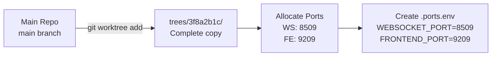
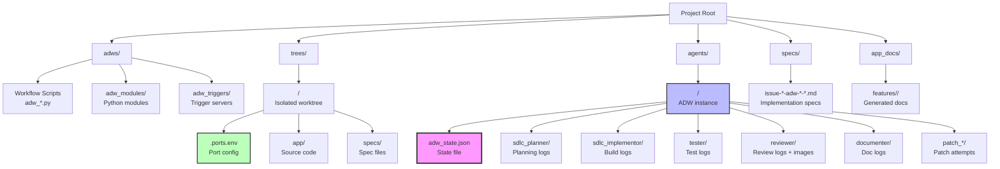

# ADW System Quick Reference Guide

Visual quick reference for understanding ADW workflows with concrete examples.

## Table of Contents

1. [Workflow Types Comparison](#workflow-types-comparison)
2. [Real Example Walkthrough](#real-example-walkthrough)
3. [File Locations Cheat Sheet](#file-locations-cheat-sheet)
4. [Common Scenarios](#common-scenarios)
5. [Debugging Guide](#debugging-guide)

---

## Workflow Types Comparison

Visual comparison of different ADW workflow types.

```mermaid
graph LR
    subgraph "Entry Point Workflows (Create Worktrees)"
        PLAN[adw_plan_iso<br/>Planning Only<br/>✓ Creates worktree<br/>✓ Generates spec<br/>✗ No implementation]
        PATCH[adw_patch_iso<br/>Quick Patch<br/>✓ Creates worktree<br/>✓ Direct implementation<br/>✓ No planning phase]
    end

    subgraph "Dependent Workflows (Require Worktree)"
        BUILD[adw_build_iso<br/>Build Only<br/>✗ Needs existing worktree<br/>✓ Implements plan<br/>✗ No testing]
        TEST[adw_test_iso<br/>Test Only<br/>✗ Needs existing worktree<br/>✓ Runs tests<br/>✓ Auto-fixes failures]
        REVIEW[adw_review_iso<br/>Review Only<br/>✗ Needs existing worktree<br/>✓ Takes screenshots<br/>✓ Validates spec]
        DOC[adw_document_iso<br/>Document Only<br/>✗ Needs existing worktree<br/>✓ Generates docs<br/>✗ No implementation]
        SHIP[adw_ship_iso<br/>Ship Only<br/>✗ Needs existing worktree<br/>✓ Approves PR<br/>✓ Merges to main]
    end

    subgraph "Composite Workflows"
        PB[adw_plan_build_iso<br/>Plan → Build<br/>⏱ ~5-10 min<br/>Best for: Quick features]
        PBT[adw_plan_build_test_iso<br/>Plan → Build → Test<br/>⏱ ~10-15 min<br/>Best for: Tested features]
        PBTR[adw_plan_build_test_review_iso<br/>Plan → Build → Test → Review<br/>⏱ ~15-25 min<br/>Best for: UI features]
        SDLC[adw_sdlc_iso<br/>Full Pipeline<br/>Plan → Build → Test → Review → Doc<br/>⏱ ~20-30 min<br/>Best for: Complete features]
        ZTE[adw_sdlc_zte_iso<br/>Zero Touch Execution<br/>Full SDLC + Auto-merge<br/>⏱ ~20-30 min<br/>⚠️ Auto-ships to main!]
    end

    PLAN -.->|Use separately| BUILD
    BUILD -.->|Use separately| TEST
    TEST -.->|Use separately| REVIEW
    REVIEW -.->|Use separately| DOC
    DOC -.->|Use separately| SHIP

    style PLAN fill:#bfb,stroke:#333,stroke-width:2px
    style PATCH fill:#bfb,stroke:#333,stroke-width:2px
    style SDLC fill:#f9f,stroke:#333,stroke-width:3px
    style ZTE fill:#fbb,stroke:#333,stroke-width:3px
```



**Selection Guide:**

| Use Case | Recommended Workflow | Why? |
|----------|---------------------|------|
| Generate implementation plan only | `adw_plan_iso` | Creates spec for manual review before implementation |
| Quick fix without planning | `adw_patch_iso` | Direct fix, skips planning phase |
| Implement existing plan | `adw_build_iso` | When you already have a plan file |
| Simple backend feature | `adw_plan_build_iso` | Fast, no testing or review needed |
| API endpoint with tests | `adw_plan_build_test_iso` | Ensures tests pass |
| UI feature needing validation | `adw_plan_build_test_review_iso` | Captures screenshots, validates UI |
| Complete feature with docs | `adw_sdlc_iso` | Full pipeline, manual merge |
| Trusted automated fix | `adw_sdlc_zte_iso` | Complete automation (use carefully!) |

---

## Real Example Walkthrough

Concrete example: Adding an export button to a data table.

### Issue #456: Add CSV Export Button

**Initial State:**
```
User creates GitHub issue #456:
Title: "Add CSV export button to data table"
Body: "Users should be able to export the current table data as CSV"
Labels: [enhancement]
```

### Step 1: Workflow Trigger

```bash
# Manual trigger
cd adws
uv run adw_sdlc_iso.py 456

# Output:
# Using ADW ID: 3f8a2b1c
# Creating worktree at trees/3f8a2b1c/
```

### Step 2: State Initialization

**File Created:** `agents/3f8a2b1c/adw_state.json`

```json
{
  "adw_id": "3f8a2b1c",
  "issue_number": "456",
  "branch_name": null,
  "plan_file": null,
  "issue_class": null,
  "worktree_path": null,
  "websocket_port": null,
  "frontend_port": null,
  "model_set": "base",
  "all_adws": [],
  "data_source": "github",
  "completed": false
}
```

### Step 3: Worktree Creation



**Directory Structure After Creation:**
```
trees/3f8a2b1c/
├── .env (copied from main)
├── .ports.env (newly created)
├── app/
│   ├── components/
│   ├── pages/
│   └── ...
├── adws/ (same as main)
└── .git (worktree git directory)
```

**State Updated:**
```json
{
  "adw_id": "3f8a2b1c",
  "issue_number": "456",
  "worktree_path": "/path/to/project/trees/3f8a2b1c",
  "websocket_port": 8509,
  "frontend_port": 9209,
  ...
}
```

### Step 4: Planning Phase

**Command Executed:**
```bash
claude --headless \
  --model sonnet \
  --output agents/3f8a2b1c/sdlc_planner/raw_output.jsonl \
  --cwd trees/3f8a2b1c \
  /feature 456 3f8a2b1c "{\"number\":456,\"title\":\"Add CSV export button\",\"body\":\"...\"}"
```

**Files Created:**

1. `agents/3f8a2b1c/sdlc_planner/raw_output.jsonl`
   - Full JSONL log of Claude's planning session
   - Contains: analysis, planning, file modifications

2. `specs/issue-456-adw-3f8a2b1c-add-csv-export-button.md`
   ```markdown
   # Implementation Plan: Add CSV Export Button

   ## Overview
   Add a CSV export button to the data table component...

   ## Technical Approach
   1. Create export utility function
   2. Add ExportButton component
   3. Wire up to DataTable

   ## Files to Modify
   - app/components/DataTable.tsx
   - app/utils/export.ts (create new)

   ## Testing
   - Unit test for export utility
   - Integration test for button click
   ```

3. `agents/3f8a2b1c/3f8a2b1c_plan_spec.md` (copy of spec)

**Branch Created:**
```bash
# In worktree
git checkout -b feat-issue-456-adw-3f8a2b1c-add-csv-export-button
```

**State Updated:**
```json
{
  "adw_id": "3f8a2b1c",
  "issue_number": "456",
  "branch_name": "feat-issue-456-adw-3f8a2b1c-add-csv-export-button",
  "plan_file": "specs/issue-456-adw-3f8a2b1c-add-csv-export-button.md",
  "issue_class": "/feature",
  "worktree_path": "/path/to/project/trees/3f8a2b1c",
  "websocket_port": 8509,
  "frontend_port": 9209,
  ...
}
```

**Git Operations:**
```bash
# In worktree trees/3f8a2b1c/
git add specs/issue-456-adw-3f8a2b1c-add-csv-export-button.md
git commit -m "feat: plan for CSV export button (issue #456)"
git push -u origin feat-issue-456-adw-3f8a2b1c-add-csv-export-button
```

**PR Created:**
```
Title: feat: Add CSV export button (issue #456)
Branch: feat-issue-456-adw-3f8a2b1c-add-csv-export-button
Body:
  ## Implementation Plan

  This PR implements CSV export functionality for the data table.

  ADW ID: 3f8a2b1c
  Issue: #456

  [Link to plan](specs/issue-456-adw-3f8a2b1c-add-csv-export-button.md)
```

### Step 5: Build Phase

**Command Executed:**
```bash
claude --headless \
  --model sonnet \
  --output agents/3f8a2b1c/sdlc_implementor/raw_output.jsonl \
  --cwd trees/3f8a2b1c \
  /implement specs/issue-456-adw-3f8a2b1c-add-csv-export-button.md
```

**Files Modified (in worktree):**

1. `trees/3f8a2b1c/app/utils/export.ts` (created)
   ```typescript
   export function exportToCSV(data: any[], filename: string) {
     const csv = convertToCSV(data);
     downloadCSV(csv, filename);
   }
   ```

2. `trees/3f8a2b1c/app/components/ExportButton.tsx` (created)
   ```typescript
   export function ExportButton({ data }: Props) {
     return (
       <button onClick={() => exportToCSV(data, 'export.csv')}>
         Export CSV
       </button>
     );
   }
   ```

3. `trees/3f8a2b1c/app/components/DataTable.tsx` (modified)
   ```typescript
   // Added export button to toolbar
   <ExportButton data={tableData} />
   ```

**Commit:**
```bash
git add .
git commit -m "feat: implement CSV export button"
git push
```

### Step 6: Test Phase

**Command Executed:**
```bash
claude --headless \
  --model sonnet \
  --output agents/3f8a2b1c/tester/raw_output.jsonl \
  --cwd trees/3f8a2b1c \
  /test
```

**Tests Run (in worktree):**
```bash
# Inside Claude Code execution
npm test -- app/utils/export.test.ts
npm test -- app/components/ExportButton.test.tsx
npm test -- app/components/DataTable.test.tsx
```

**Test Results:**
```
✓ export.test.ts (3 tests)
✓ ExportButton.test.tsx (2 tests)
✓ DataTable.test.tsx (5 tests)

All tests passed!
```

### Step 7: Review Phase

**Command Executed:**
```bash
claude --headless \
  --model sonnet \
  --output agents/3f8a2b1c/reviewer/raw_output.jsonl \
  --cwd trees/3f8a2b1c \
  /review
```

**Review Process:**

1. **Start Services in Worktree:**
   ```bash
   # Using ports from .ports.env
   npm run dev -- --port 9209
   # WebSocket server on 8509
   ```

2. **Take Screenshots:**
   ```
   agents/3f8a2b1c/reviewer/review_img/
   ├── 01_table_with_export_button.png
   ├── 02_export_button_hover.png
   └── 03_export_download_dialog.png
   ```

3. **Upload to R2:**
   ```
   https://storage.example.com/adw/3f8a2b1c/review/01_table_with_export_button.png
   https://storage.example.com/adw/3f8a2b1c/review/02_export_button_hover.png
   https://storage.example.com/adw/3f8a2b1c/review/03_export_download_dialog.png
   ```

4. **Review Result:**
   ```json
   {
     "success": true,
     "review_summary": "CSV export button successfully implemented. Button appears in table toolbar, exports data correctly on click.",
     "review_issues": [],
     "screenshots": ["01_table_with_export_button.png", "02_export_button_hover.png", "03_export_download_dialog.png"],
     "screenshot_urls": ["https://storage.example.com/adw/3f8a2b1c/review/01_..."]
   }
   ```

5. **Update PR with Screenshots:**
   ```markdown
   ## Review Screenshots

   
   
   
   ```

### Step 8: Documentation Phase

**Command Executed:**
```bash
claude --headless \
  --model sonnet \
  --output agents/3f8a2b1c/documenter/raw_output.jsonl \
  --cwd trees/3f8a2b1c \
  /document
```

**Files Created:**

1. `app_docs/features/csv-export/overview.md`
   ```markdown
   # CSV Export Feature

   ## Overview
   Users can now export table data to CSV format...

   ## User Guide
   1. Click "Export CSV" button in table toolbar
   2. CSV file downloads automatically
   ```

2. `app_docs/features/csv-export/technical-guide.md`
   ```markdown
   # CSV Export - Technical Guide

   ## Architecture
   - Export utility: `app/utils/export.ts`
   - UI component: `app/components/ExportButton.tsx`

   ## API
   ```typescript
   exportToCSV(data: any[], filename: string): void
   ```
   ```

### Step 9: Ship Phase (If ZTE)

**Command Executed:**
```bash
# Only if using adw_sdlc_zte_iso
# Otherwise, manual merge via GitHub UI
```

**Ship Process:**

1. **Validate State:**
   ```
   ✓ adw_id: 3f8a2b1c
   ✓ issue_number: 456
   ✓ branch_name: feat-issue-456-adw-3f8a2b1c-add-csv-export-button
   ✓ plan_file: specs/issue-456-adw-3f8a2b1c-add-csv-export-button.md
   ✓ issue_class: /feature
   ✓ worktree_path: /path/to/project/trees/3f8a2b1c
   ```

2. **Approve PR:**
   ```bash
   gh pr review <pr-number> --approve \
     --body "ADW Ship workflow approved this PR after validating all state fields."
   ```

3. **Merge PR:**
   ```bash
   gh pr merge <pr-number> --squash --delete-branch
   ```

4. **Cleanup:**
   ```bash
   git worktree remove trees/3f8a2b1c --force
   ```

5. **Mark Complete:**
   ```json
   {
     "adw_id": "3f8a2b1c",
     "completed": true,
     ...
   }
   ```

### Final Artifacts

**File System After Completion:**

```
agents/3f8a2b1c/
├── adw_state.json (completed: true)
├── 3f8a2b1c_plan_spec.md
├── sdlc_planner/
│   ├── raw_output.jsonl (12 KB)
│   └── prompts/
│       ├── feature.txt
│       └── classify_issue.txt
├── sdlc_implementor/
│   ├── raw_output.jsonl (45 KB)
│   └── prompts/
│       └── implement.txt
├── tester/
│   ├── raw_output.jsonl (18 KB)
│   └── prompts/
│       └── test.txt
├── reviewer/
│   ├── raw_output.jsonl (25 KB)
│   ├── review_img/
│   │   ├── 01_table_with_export_button.png
│   │   ├── 02_export_button_hover.png
│   │   └── 03_export_download_dialog.png
│   └── prompts/
│       └── review.txt
└── documenter/
    ├── raw_output.jsonl (15 KB)
    └── prompts/
        └── document.txt

specs/
└── issue-456-adw-3f8a2b1c-add-csv-export-button.md

app_docs/features/csv-export/
├── overview.md
├── technical-guide.md
└── images/ (if any)

# Main repo now has:
app/utils/export.ts
app/components/ExportButton.tsx
app/components/DataTable.tsx (modified)

# Worktree removed:
# trees/3f8a2b1c/ (deleted)
```

**GitHub Artifacts:**

- ✅ PR merged to main
- ✅ Branch deleted
- ✅ Issue #456 closed
- ✅ Comments with ADW tracking info

---

## File Locations Cheat Sheet

Quick reference for finding specific files.



**Common Lookup Table:**

| What I Want | Where to Find It | Example Path |
|-------------|------------------|--------------|
| ADW state | `agents/<adw_id>/adw_state.json` | `agents/3f8a2b1c/adw_state.json` |
| Worktree location | State file → `worktree_path` | `trees/3f8a2b1c/` |
| Port numbers | Worktree → `.ports.env` | `trees/3f8a2b1c/.ports.env` |
| Implementation plan | State → `plan_file` | `specs/issue-456-adw-3f8a2b1c-*.md` |
| Branch name | State → `branch_name` | `feat-issue-456-adw-3f8a2b1c-*` |
| Planning logs | `agents/<adw_id>/sdlc_planner/raw_output.jsonl` | Full JSONL session |
| Build logs | `agents/<adw_id>/sdlc_implementor/raw_output.jsonl` | Full JSONL session |
| Test logs | `agents/<adw_id>/tester/raw_output.jsonl` | Full JSONL session |
| Review screenshots | `agents/<adw_id>/reviewer/review_img/` | PNG files |
| Generated docs | `app_docs/features/<feature-name>/` | Markdown files |
| Worktree source code | `trees/<adw_id>/app/` | TypeScript/JS files |
| Slash command prompts | `agents/<adw_id>/<agent>/prompts/` | `.txt` files |

---

## Common Scenarios

### Scenario 1: Resume a Failed Workflow

**Problem:** Workflow failed during test phase due to network issue.

**Solution:**

```bash
# 1. Find the ADW ID from the error message or agents/ directory
ls agents/
# Output: 3f8a2b1c/  abc12345/  def67890/

# 2. Check the state to see what completed
cat agents/3f8a2b1c/adw_state.json | jq '.plan_file, .branch_name'
# Output:
# "specs/issue-456-adw-3f8a2b1c-add-csv-export-button.md"
# "feat-issue-456-adw-3f8a2b1c-add-csv-export-button"

# 3. Resume from the failed phase
cd adws
uv run adw_test_iso.py 456 3f8a2b1c

# Workflow will:
# - Load existing state
# - Validate worktree exists
# - Continue from test phase
```

### Scenario 2: Run Multiple ADWs in Parallel

**Problem:** Want to work on 3 issues simultaneously.

**Solution:**

```bash
# Terminal 1
cd adws
uv run adw_sdlc_iso.py 101
# Creates worktree trees/aaa11111/ with ports 8500, 9200

# Terminal 2 (while Terminal 1 is running)
uv run adw_sdlc_iso.py 102
# Creates worktree trees/bbb22222/ with ports 8501, 9201

# Terminal 3 (while others are running)
uv run adw_sdlc_iso.py 103
# Creates worktree trees/ccc33333/ with ports 8502, 9202

# All run independently with no conflicts!
```

### Scenario 3: Debug a Claude Code Execution

**Problem:** Implementation didn't work as expected.

**Solution:**

```bash
# 1. Find the execution log
cd agents/3f8a2b1c/sdlc_implementor/

# 2. View the raw JSONL output
cat raw_output.jsonl | jq '.type, .message.content[0].text' | less

# 3. Check what prompt was sent
cat prompts/implement.txt

# 4. See the final result
tail -1 raw_output.jsonl | jq '.result'

# 5. Check what files Claude modified
cd ../../trees/3f8a2b1c/
git diff main
```

### Scenario 4: Manually Merge After Review

**Problem:** Want to review changes before merging.

**Solution:**

```bash
# 1. Run workflow without auto-ship
cd adws
uv run adw_sdlc_iso.py 456  # NOT adw_sdlc_zte_iso

# 2. Review the PR on GitHub
# Click the PR link from the output

# 3. If satisfied, merge via GitHub UI or:
cd ..  # Back to project root
gh pr merge <pr-number> --squash

# 4. Clean up worktree
cd adws
uv run adw_modules/worktree_ops.py remove 3f8a2b1c
```

### Scenario 5: Check Port Usage

**Problem:** Want to see which ADWs are using which ports.

**Solution:**

```bash
# 1. List all worktrees
git worktree list

# 2. Check port assignments
for adw_id in agents/*/; do
  id=$(basename $adw_id)
  if [ -f "trees/$id/.ports.env" ]; then
    echo "ADW $id:"
    cat "trees/$id/.ports.env"
    echo
  fi
done

# Output:
# ADW 3f8a2b1c:
# WEBSOCKET_PORT=8509
# FRONTEND_PORT=9209
#
# ADW abc12345:
# WEBSOCKET_PORT=8507
# FRONTEND_PORT=9207
```

### Scenario 6: Rerun Just the Review Phase

**Problem:** Review failed due to port conflict, want to retry.

**Solution:**

```bash
# 1. Check the state
cat agents/3f8a2b1c/adw_state.json | jq '.worktree_path'
# Output: "/path/to/trees/3f8a2b1c"

# 2. Verify worktree exists
ls trees/3f8a2b1c/

# 3. Rerun review only
cd adws
uv run adw_review_iso.py 456 3f8a2b1c

# This will:
# - Use existing worktree
# - Allocate ports (or use existing)
# - Take new screenshots
# - Update the PR
```

---

## Debugging Guide

### Issue: "No worktree found"

**Error Message:**
```
Error: No worktree_path in state
```

**Diagnosis:**
```bash
# Check state file
cat agents/<adw_id>/adw_state.json | jq '.worktree_path'
# Output: null (bad!) or "/path/to/trees/<adw_id>" (good!)

# Check if worktree exists
git worktree list
```

**Solutions:**

1. **If this is a dependent workflow (build, test, review):**
   ```bash
   # You must run an entry point workflow first
   uv run adw_plan_iso.py <issue> <adw_id>
   ```

2. **If worktree was manually deleted:**
   ```bash
   # Recreate it (if you have the branch)
   git worktree add trees/<adw_id> <branch_name>

   # Update state
   # Edit agents/<adw_id>/adw_state.json manually
   ```

### Issue: Port Already in Use

**Error Message:**
```
Error: Port 8507 is already in use
```

**Diagnosis:**
```bash
# Check what's using the port
lsof -i :8507

# Output:
# COMMAND   PID   USER   FD   TYPE DEVICE SIZE/OFF NODE NAME
# node      1234  user   23u  IPv4  ...          TCP *:8507 (LISTEN)
```

**Solutions:**

1. **Kill the process:**
   ```bash
   kill -9 1234
   ```

2. **Let ADW find next available port:**
   - ADW automatically tries next port in range (8500-8514)
   - If all busy, it will error

3. **Clean up old worktrees:**
   ```bash
   # List all worktrees
   git worktree list

   # Remove unused ones
   git worktree remove trees/<old_adw_id>
   ```

### Issue: Claude Code Execution Failed

**Error Message:**
```
Error: Claude Code execution failed with exit code 1
```

**Diagnosis:**
```bash
# Check the logs
cd agents/<adw_id>/<agent_name>/
tail -20 raw_output.jsonl | jq '.'

# Check for error messages
grep -i error raw_output.jsonl | jq '.message.content[0].text'

# Check the prompt that was sent
cat prompts/<command_name>.txt
```

**Solutions:**

1. **Check API credits:**
   ```bash
   # Claude Code needs valid Anthropic API key
   echo $ANTHROPIC_API_KEY
   ```

2. **Retry with verbose logging:**
   ```bash
   export ADW_DEBUG=true
   uv run adw_build_iso.py <issue> <adw_id>
   ```

3. **Check worktree state:**
   ```bash
   cd trees/<adw_id>/
   git status
   # Make sure it's clean
   ```

### Issue: State File Corrupted

**Error Message:**
```
Failed to load state: Expecting value: line 1 column 1 (char 0)
```

**Diagnosis:**
```bash
# Check if file is valid JSON
cat agents/<adw_id>/adw_state.json | jq '.'
```

**Solutions:**

1. **Restore from backup (if available):**
   ```bash
   # ADW doesn't create backups, but git might have it
   git log -- agents/<adw_id>/adw_state.json
   git show <commit>:agents/<adw_id>/adw_state.json > agents/<adw_id>/adw_state.json
   ```

2. **Manually recreate:**
   ```json
   {
     "adw_id": "<adw_id>",
     "issue_number": "<issue>",
     "branch_name": "<branch>",
     "plan_file": "specs/issue-<issue>-adw-<adw_id>-*.md",
     "issue_class": "/feature",
     "worktree_path": "/full/path/to/trees/<adw_id>",
     "websocket_port": 8507,
     "frontend_port": 9207,
     "model_set": "base",
     "all_adws": [],
     "data_source": "github",
     "completed": false
   }
   ```

### Issue: Tests Keep Failing

**Error Message:**
```
Tests failed after 3 resolution attempts
```

**Diagnosis:**
```bash
# Check test logs
cd agents/<adw_id>/tester/
cat raw_output.jsonl | jq 'select(.type == "result")' | jq '.result'

# Run tests manually in worktree
cd ../../trees/<adw_id>/
npm test
```

**Solutions:**

1. **Skip auto-resolution and fix manually:**
   ```bash
   # Run test workflow without auto-fix
   cd adws
   uv run adw_test_iso.py <issue> <adw_id> --no-auto-fix

   # Fix manually in worktree
   cd ../trees/<adw_id>/
   # Edit files, run tests manually
   npm test

   # Commit fixes
   git add .
   git commit -m "fix: manual test fixes"
   git push
   ```

2. **Use patch workflow:**
   ```bash
   # Create a patch to fix the test issues
   uv run adw_patch_iso.py <issue> <adw_id>
   # In GitHub, add comment with patch request
   ```

---

## Summary

This quick reference provides:

1. **Visual Workflow Comparison**: Choose the right workflow for your task
2. **Real Example**: Complete walkthrough from trigger to completion
3. **File Locations**: Quick lookup for finding any file
4. **Common Scenarios**: Solutions for typical use cases
5. **Debugging Guide**: Diagnose and fix common issues

Use this alongside the [Deep Dive Guide](./adw_system_deep_dive.md) for complete understanding of the ADW system.
