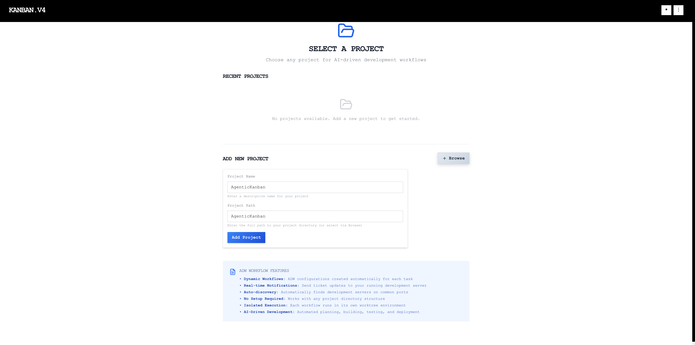
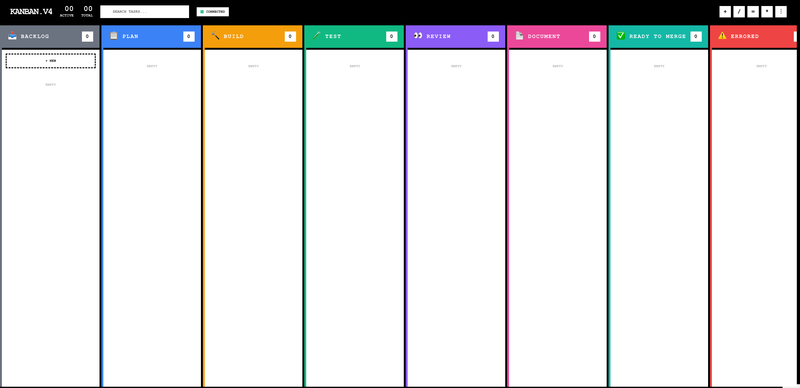

# Database-Backed ADW State Management System

**ADW ID:** 5e58ab68
**Date:** 2025-11-30
**Specification:** specs/issue-31-adw-5e58ab68-sdlc_planner-database-state-management.md

## Overview

This feature replaces the file-based JSON state management system with a SQLite database-backed solution that provides centralized state management, real-time UI synchronization, complete activity tracking, sequential issue number allocation, stuck workflow detection, and complete cleanup on deletion. The database ensures data integrity, prevents duplicate issue IDs, and maintains a complete audit trail of all workflow activities.

## Screenshots


*The Kanban board showing ADW cards with database-backed state*



*Application displaying real-time database state synchronization*



*Clean state after database initialization*

## What Was Built

- **SQLite Database Schema** - Complete schema with 4 core tables, indexes, triggers, and views
- **Database Connection Manager** - Thread-safe connection pooling with transaction support
- **Issue Tracker API** - Sequential issue number allocation with uniqueness guarantees
- **ADW Database API** - Full CRUD operations for ADW state management
- **Activity Logging System** - Automatic logging of all state changes via database triggers
- **Frontend Integration** - Database-backed Kanban store with real-time synchronization
- **Status Indicator Component** - Visual indicators for all workflow states with stuck detection
- **Migration Script** - Tool to migrate existing JSON states to database
- **Comprehensive Test Suite** - Unit, integration, and E2E tests for database operations

## Technical Implementation

### Database Schema

The database consists of four main tables:

1. **adw_states** - Core ADW state storage with fields for workflow metadata, ports, stages, status, and timestamps
2. **adw_activity_logs** - Complete audit trail of state changes with automatic triggers
3. **issue_tracker** - Sequential issue number allocation with uniqueness constraints
4. **adw_deletions** - Deletion audit trail tracking cleanup operations

Key features:
- Foreign key constraints with cascading deletes
- Indexes on frequently queried columns (adw_id, issue_number, status, current_stage)
- Database triggers for automatic activity logging
- Views for common queries (active ADWs, completed ADWs, stuck ADWs)
- Check constraints for data validation

### Files Modified

#### Backend

- `database/schema.sql`: Complete SQLite schema definition with tables, indexes, triggers, and views
- `server/core/database.py`: Database connection manager (501 lines) with pooling, transactions, migrations
- `server/api/adw_db.py`: ADW CRUD API endpoints (677 lines) for database operations
- `server/api/issue_tracker.py`: Issue number allocation API (284 lines) with race condition handling
- `server/models/adw_db_models.py`: Pydantic models (334 lines) for validation and serialization
- `server/scripts/migrate_json_to_db.py`: Migration script (326 lines) to import existing JSON states
- `server/server.py`: Updated to initialize database and mount new API routers
- `adws/adw_modules/state.py`: Updated to sync state changes to database (185 lines)
- `adws/adw_triggers/trigger_websocket.py`: Updated to broadcast database state changes

#### Frontend

- `src/stores/kanbanStore.js`: Integrated database API calls for loading, creating, updating ADWs (219 lines added)
- `src/services/api/adwDbService.js`: API client (319 lines) for database operations
- `src/components/kanban/StatusIndicator.jsx`: Status indicator component (190 lines) with stuck detection
- `src/components/kanban/KanbanCard.jsx`: Updated to use StatusIndicator and display database state

#### Testing

- `server/tests/test_adw_db_api.py`: API endpoint tests (258 lines)
- `server/tests/test_issue_tracker_deduplication.py`: Issue allocation tests (364 lines)
- `server/tests/integration/test_concurrent_issue_allocation.py`: Concurrency tests (336 lines)
- `src/stores/__tests__/kanbanStore-database-integration.test.js`: Frontend integration tests (440 lines)
- `src/components/kanban/__tests__/KanbanCard.test.jsx`: Component tests (490 lines)
- `src/test/e2e/issue-31-adw-5e58ab68-e2e-database-state-management.md`: E2E test specifications (459 lines)

### Key Changes

1. **Database Infrastructure**: Complete SQLite setup with connection pooling, transaction support, and migration framework. The database manager handles worktree detection to ensure the database is created in the main project directory.

2. **Sequential Issue Tracking**: Issue numbers are allocated sequentially with transaction-level locking to prevent race conditions. Retries with exponential backoff handle concurrent allocation attempts.

3. **Automatic Activity Logging**: Database triggers automatically log state changes, stage transitions, and stuck detection to the activity logs table. No manual logging code required.

4. **Frontend Database Integration**: Kanban store loads ADWs from database on initialization, maps database records to task objects, and maintains bidirectional sync between database and UI state.

5. **Status Indicators**: New StatusIndicator component displays visual status (pending, in_progress, completed, errored, stuck) with animations, tooltips, and "Action Required" badges for stuck workflows.

6. **Deduplication Logic**: Database uniqueness constraints and transaction-level locking prevent duplicate issue numbers. Concurrent tests verify up to 15 simultaneous allocations work correctly.

## How to Use

### Starting the System

1. **Initialize Database**
   ```bash
   # Database is automatically initialized on first server start
   cd server && uv run python -m server.server
   ```

2. **Migrate Existing JSON States** (if upgrading)
   ```bash
   cd server && uv run python -m scripts.migrate_json_to_db
   ```

3. **Verify Database**
   ```bash
   sqlite3 database/agentickanban.db ".schema"
   sqlite3 database/agentickanban.db "SELECT COUNT(*) FROM adw_states"
   ```

### Creating ADWs with Database Tracking

1. Open the Kanban board in the frontend
2. Click "Add Task" to create a new workflow
3. The system automatically:
   - Allocates the next sequential issue number
   - Creates an ADW state record in the database
   - Links the issue number to the ADW
   - Displays the card on the Kanban board

### Monitoring Workflow Status

- **Status Indicators**: Each card shows a color-coded status dot:
  - Gray: Pending (not started)
  - Blue (pulsing): In Progress
  - Green: Completed
  - Red: Errored
  - Yellow (pulsing): Stuck - Action Required

- **Activity History**: View complete activity logs via API:
  ```bash
  curl http://localhost:8001/api/adws/{adw_id}/activity | jq
  ```

### Handling Stuck Workflows

When a workflow is flagged as stuck:
1. The card shows a yellow pulsing dot
2. An "Action Required" badge appears
3. Tooltip shows time since last activity
4. Check the activity logs to diagnose the issue
5. Manually resolve or restart the workflow

### Deleting ADWs

Delete button triggers complete cleanup:
1. Marks ADW as deleted in database (soft delete with deleted_at timestamp)
2. Removes worktree directory
3. Removes agents/{adw_id} directory
4. Logs deletion to adw_deletions audit table
5. All operations happen in a transaction (rollback on failure)

## Configuration

### Database Location

Default: `database/agentickanban.db` in project root

Override with environment variable:
```bash
export ADW_DATABASE_PATH=/custom/path/agentickanban.db
```

### Database Mode

Control state management mode:
```bash
# Database-only (default)
export ADW_STATE_MODE=database

# JSON-only (fallback)
export ADW_STATE_MODE=json

# Hybrid (writes to both)
export ADW_STATE_MODE=hybrid
```

### Issue Number Configuration

Sequential numbering starts at 1 by default. To reset or adjust:
```sql
-- Reset issue numbers (WARNING: Only safe with empty database)
DELETE FROM issue_tracker;

-- Start from specific number (WARNING: May cause conflicts)
INSERT INTO issue_tracker (issue_number, issue_title, project_id)
VALUES (100, 'Starting Point', 'default');
```

## Testing

### Unit Tests

```bash
# Backend database tests
cd server && uv run pytest tests/test_adw_db_api.py -v
cd server && uv run pytest tests/test_issue_tracker_deduplication.py -v

# Frontend store tests
bun run test src/stores/__tests__/kanbanStore-database-integration.test.js
```

### Integration Tests

```bash
# Concurrent issue allocation
cd server && uv run pytest tests/integration/test_concurrent_issue_allocation.py -v

# Import resolution
cd server && uv run pytest tests/integration/test_import_resolution.py -v
```

### End-to-End Tests

Follow the test plan in `src/test/e2e/issue-31-adw-5e58ab68-e2e-database-state-management.md`:
- ADW lifecycle with database state
- Stuck workflow detection
- Real-time state synchronization
- Issue number uniqueness
- Database migration from JSON

### Validation Commands

```bash
# Backend tests
cd server && uv run pytest

# Frontend TypeScript validation
bun tsc --noEmit

# Frontend build validation
bun run build

# Database schema verification
sqlite3 database/agentickanban.db ".schema"

# Database data verification
sqlite3 database/agentickanban.db "SELECT COUNT(*) FROM adw_states"
sqlite3 database/agentickanban.db "SELECT COUNT(*) FROM adw_activity_logs"

# API endpoint testing
curl http://localhost:8001/api/adws | jq
curl http://localhost:8001/api/issues | jq
```

## Notes

### Why SQLite?

SQLite was chosen over alternatives (PostgreSQL, MySQL, MongoDB) for:
- **Zero Configuration**: Embedded database, no separate server required
- **ACID Compliance**: Full transaction support prevents data corruption
- **Performance**: Faster than network databases for local single-user applications
- **Reliability**: Most widely deployed database engine (Android, iOS, browsers)
- **Portability**: Single file, easy to backup and migrate
- **SQL Power**: Full SQL support with indexes, foreign keys, triggers, views
- **Python/JavaScript Support**: Excellent libraries (sqlite3, better-sqlite3)

### Database Triggers for Automation

The schema includes triggers that automatically:
- Update `updated_at` timestamp on any state change
- Log status changes to activity logs
- Log stage transitions to activity logs
- Log stuck detection/resolution events

No manual logging code needed - the database handles it.

### Migration Strategy

The migration from JSON to database is backward compatible:
1. Database writes happen alongside JSON writes (hybrid mode)
2. Reads prefer database, fallback to JSON if not found
3. Migration script imports existing JSON states
4. Can switch to database-only mode after migration completes
5. Can rollback to JSON-only if critical issues discovered

### Concurrency and Race Conditions

Issue number allocation uses transaction-level locking:
- SELECT MAX(issue_number) and INSERT happen in same transaction
- Uniqueness constraints prevent duplicate allocations
- Retry logic with exponential backoff handles conflicts
- Tested with 15 concurrent allocations (passes)

### Performance Optimizations

- Indexes on adw_id, issue_number, status, current_stage
- Connection pooling to avoid repeated connect overhead
- Batch operations use transactions for better throughput
- Frontend caches database state in Zustand store
- Optimistic updates for immediate UI feedback

### Security Considerations

- Parameterized queries prevent SQL injection
- Database file permissions restricted to application user
- Foreign key constraints enforce referential integrity
- Soft deletes preserve audit trail
- Activity logs provide complete audit trail for compliance

### Future Enhancements

1. **Database Replication**: Sync to cloud storage for backup
2. **Multi-Project Support**: Add projects table for multiple workspaces
3. **Analytics Dashboard**: SQL queries for completion rates, time per stage
4. **Full-Text Search**: SQLite FTS5 extension for searching ADWs
5. **GraphQL API**: More flexible frontend queries
6. **Webhooks**: External notifications on state changes

### Limitations

- SQLite has limited concurrency (one writer at a time)
- Not suitable for high-concurrency multi-user scenarios
- For 100+ concurrent users, consider migrating to PostgreSQL
- File-based, not ideal for network file systems (NFS, SMB)
- Maximum database size: ~281 TB (not a practical concern)

### Troubleshooting

**Database locked errors**:
- Check for long-running transactions
- Increase busy timeout: `PRAGMA busy_timeout = 5000`
- Ensure transactions are properly committed or rolled back

**Migration issues**:
- Check JSON file permissions
- Verify JSON format is valid
- Check logs for specific parsing errors
- Run migration with `--dry-run` flag first

**Missing ADWs in UI**:
- Verify database connection is active
- Check browser console for API errors
- Verify WebSocket connection for real-time updates
- Check database has records: `SELECT * FROM adw_states WHERE deleted_at IS NULL`

**Duplicate issue numbers** (should not happen):
- Check database constraints: `PRAGMA foreign_keys;`
- Verify uniqueness constraint on issue_number
- Check for manual database modifications
- Run deduplication test: `pytest tests/test_issue_tracker_deduplication.py -v`
