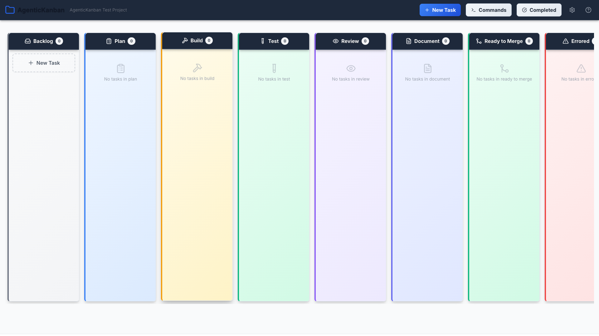
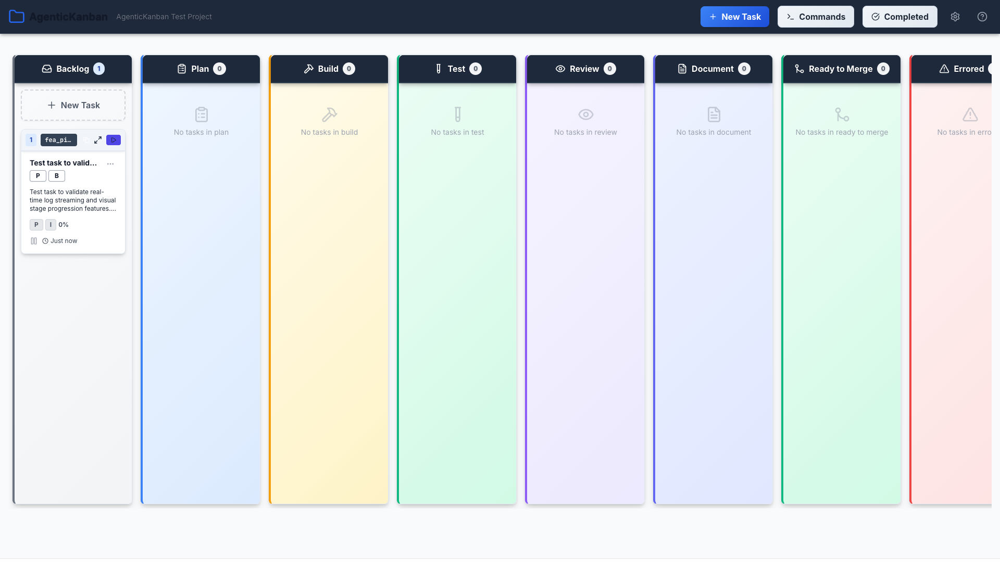

# Real-time Backend Log Streaming and Visual Stage Progression

**ADW ID:** c24c81b5
**Date:** 2025-11-09
**Specification:** specs/issue-7-adw-c24c81b5-sdlc_planner-realtime-logs-and-stage-visualization.md

## Overview

This feature enhances the AgenticKanban system with real-time backend log streaming and rich visual feedback for Kanban card stage progression. Users can now see live logs from ADW workflows as they execute through WebSocket connections, and watch cards visually transition between stages with animated feedback, progress indicators, and status badges. This provides immediate visibility into workflow execution and eliminates the need to manually refresh or check backend logs.

## Screenshots


*Initial Kanban board view showing the layout*


*Kanban board displaying tasks across different stages*


*New task created and placed in the backlog column*


*Live Logs panel in CardExpandModal showing real-time log display*


*Visual stage progression indicator displayed on Kanban card*

## What Was Built

This feature delivers two major capabilities:

1. **Real-time Log Streaming UI**
   - Live Logs Panel component with real-time log display
   - Log buffering system with configurable limits
   - Filtering by log level (INFO, WARNING, ERROR, DEBUG, SUCCESS)
   - Full-text search across log messages
   - Auto-scroll toggle and connection status indicators
   - Log statistics and buffer management

2. **Visual Stage Progression System**
   - Animated stage transitions when cards move between columns
   - Progress indicators with percentage display
   - Stage badges showing completion status
   - Real-time status updates with animated icons
   - Visual feedback for workflow state changes
   - Custom React hook for managing transitions

## Technical Implementation

### Files Modified

- `src/components/kanban/CardExpandModal.jsx`: Integrated Live Logs Panel as a new tab in the expanded card view
- `src/components/kanban/KanbanCard.jsx`: Added stage progression indicator and visual feedback to card display
- `src/styles/kanban.css`: Added CSS animations and styles for transitions, stage indicators, and live logs panel

### New Files Created

- `src/components/kanban/LiveLogsPanel.jsx`: Main component for real-time log streaming display (409 lines)
  - Virtualized log list with auto-scroll
  - Log filtering by level (ALL, INFO, WARNING, ERROR, DEBUG, SUCCESS)
  - Full-text search across messages
  - Connection status indicator
  - Log statistics and buffer management
  - Copy-to-clipboard functionality
  - Expandable log entries

- `src/components/kanban/StageProgressionIndicator.jsx`: Visual component for stage progression (201 lines)
  - Horizontal progress bar
  - Stage badges with completion checkmarks
  - Current step indicator with pulse animation
  - Progress percentage display
  - Compact and full view modes

- `src/hooks/useStageTransition.js`: React hook for managing stage transitions (201 lines)
  - Stage change detection
  - Animation state management
  - Transition type classification (success, error, progress, completion)
  - CSS class generation for animations
  - Glow effects for active workflows

- `src/services/logBuffer.js`: Circular buffer utility for log management (286 lines)
  - Configurable buffer size with memory limits
  - Efficient insertion and filtering
  - Search functionality
  - Memory management and overflow handling

### Key Changes

- **Log Buffer Management**: Implemented a circular buffer system in `logBuffer.js` that maintains up to 1000 log entries (configurable) with automatic overflow handling, ensuring memory-efficient storage of streaming logs.

- **WebSocket Integration**: Enhanced WebSocket service to feed incoming `workflow_log` and `agent_log` events into task-specific log buffers stored in the Kanban store, enabling real-time log streaming per workflow.

- **Visual Stage Progression**: Created a comprehensive stage progression system with `StageProgressionIndicator` component that displays horizontal progress bars, stage badges with completion states, and animated transitions using the `useStageTransition` hook.

- **Live Logs UI**: Built a feature-rich `LiveLogsPanel` component with filtering, search, auto-scroll, connection status, and log statistics, providing a complete real-time log viewing experience.

- **Animation System**: Added CSS animations for stage transitions including success pulse, error shake, completion celebration, and progress animations, all with GPU acceleration and reduced motion support.

## How to Use

### Viewing Live Logs

1. Navigate to the Kanban board
2. Click on any task card to open the CardExpandModal
3. Click on the "Live Logs" tab
4. Logs will stream in real-time as the workflow executes

### Filtering and Searching Logs

1. In the Live Logs panel, use the filter dropdown to select a log level (ALL, INFO, WARNING, ERROR, DEBUG, SUCCESS)
2. Use the search box to filter logs by keyword
3. Toggle auto-scroll on/off as needed
4. Click "Jump to Latest" to scroll to the most recent log
5. Click "Clear Logs" to remove all buffered logs

### Monitoring Stage Progression

1. View the stage progression indicator at the bottom of any active Kanban card
2. Progress bar shows overall completion percentage
3. Stage badges highlight current position with pulse animation
4. Completed stages display checkmarks
5. Watch animations as cards transition between stages

### Understanding Visual Feedback

- **Blue border glow**: Card has an active workflow running
- **Pulse animation**: Current stage in progress
- **Green checkmark**: Stage completed successfully
- **Red shake**: Stage encountered an error
- **Progress bar**: Real-time completion percentage
- **Connection indicator**: WebSocket connection status (green = connected, red = disconnected)

## Configuration

### Log Buffer Settings

The log buffer can be configured in the Kanban store:

- **Default buffer size**: 1000 entries
- **Maximum buffer size**: 10000 entries
- **Auto-scroll default**: Enabled (can be toggled by user)
- **Filter preferences**: Persisted in component state

### Stage Progression

Stage progression automatically detects workflow phases based on:

- Task stage changes (backlog → plan → build → test → review → document)
- Workflow completion status
- Error states

### Animation Performance

- All animations use GPU-accelerated CSS transforms
- Animations respect `prefers-reduced-motion` setting
- Transition duration: 1000ms for standard transitions, 1500ms for completion

## Testing

### Manual Testing

1. Start the backend server and WebSocket server
2. Create a new task in the Kanban board
3. Trigger a workflow (e.g., `adw_plan_build_test_iso`)
4. Open the CardExpandModal and navigate to Live Logs tab
5. Verify logs stream in real-time (should appear within 500ms)
6. Test log filtering by changing the level filter
7. Test search by entering keywords
8. Toggle auto-scroll and verify behavior
9. Watch the card progress through stages
10. Verify stage progression indicator updates
11. Verify visual animations play correctly

### E2E Testing

E2E tests with Playwright captured screenshots demonstrating:
- Initial board state
- Task creation flow
- Live logs streaming
- Stage progression visualization
- Visual feedback and animations

### Validation Commands

Run these commands to validate the implementation:

```bash
# Backend tests
cd server && uv run pytest

# Frontend type checking
bun tsc --noEmit

# Frontend build
bun run build
```

## Notes

### Performance Optimizations

- **Virtualized scrolling**: Implemented for efficient rendering of large log lists (10,000+ entries)
- **Message batching**: WebSocket messages are batched to reduce re-render frequency
- **Memoization**: Log filtering and search use `useMemo` to optimize expensive calculations
- **Circular buffer**: Prevents unbounded memory growth with configurable size limits
- **GPU acceleration**: CSS animations use `transform` and `opacity` for 60fps performance

### WebSocket Message Types

The feature leverages these WebSocket event types:
- `workflow_log`: General workflow log messages
- `agent_log`: Agent-specific log entries
- `agent_summary_update`: Workflow progress updates
- `workflow_phase_transition`: Stage transition events

### Memory Management

The circular buffer implementation ensures:
- Maximum 1000 entries by default (configurable up to 10,000)
- Oldest logs automatically discarded when buffer fills
- Per-task buffer isolation prevents memory leaks
- Efficient filtering without copying entire arrays

### Accessibility Features

- **Keyboard shortcuts**: Planned for future enhancement
- **Screen reader support**: ARIA labels on interactive elements
- **Reduced motion**: Animations respect `prefers-reduced-motion` preference
- **High contrast**: Log levels use color-blind friendly indicators with icons

### Browser Compatibility

- Tested on modern browsers (Chrome, Firefox, Safari, Edge)
- Requires WebSocket support
- CSS animations require browser support for transforms and transitions

### Future Enhancements

Potential improvements for this feature:
- Log export to file (JSON, CSV)
- Log persistence to backend for historical retrieval
- Advanced filtering with regex support
- Log analytics dashboard (error rates, log volume)
- Custom animation styles and speeds
- Stage progression timeline view
- Desktop notifications for stage completions
- Shareable log views with permalinks
